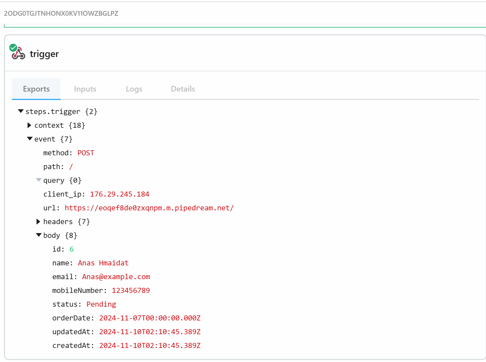

# **Sales Order System**

A full-stack application for managing sales orders and products, built using
**Node.js**, **Angular**, and **PostgreSQL**, and orchestrated with
**Docker Compose**.

---

## **Project Overview**

The Sales Order System consists of:

- **Frontend**: An Angular-based UI served via Nginx.
- **Backend**: A Node.js API powered by Express and Sequelize ORM.
- **Database**: PostgreSQL database for data storage.
- **Redis**: For background job processing and caching.
- **Redis Commander**: A UI to manage and monitor Redis data.
- **Worker**: A Node.js worker process to handle background tasks.

---

## **Table of Contents**

1. [Project Structure](#project-structure)
2. [Prerequisites](#prerequisites)
3. [Getting Started](#getting-started)
4. [Environment Variables](#environment-variables)
5. [Application Features](#application-features)
6. [Endpoints](#endpoints)
7. [Accessing the Application](#accessing-the-application)
8. [Development Setup](#development-setup)
9. [Third-Party Integration](#third-party-integration)

---

## **Project Structure**

```plaintext
sales-order-system/
├── frontend/         # Angular application
├── backend/          # Node.js backend with Express
├── docker-compose.yml # Docker Compose configuration
└── README.md         # Project documentation
```

## **Prerequisites**

Before starting, ensure you have the following installed:

- **Docker**: [Install Docker](https://docs.docker.com/get-docker/)
- **Node.js (for dev)**: Version `v22.5.0` for backend, and `v16.20.2` for frontend (nvm is recommended)
- **Angular CLI (for dev)**: Version `14.2.13`
---

## **Getting Started**

### Clone the Repository

```bash
git clone https://github.com/ahmed-hmaidat/sales-order-system.git
cd sales-order-system
```

### Build and Run the Application with Docker Compose

```bash
docker-compose up --build -d
```
This will start all the services required for the application:

- **Backend**: Node.js API on port `3000`
- **Frontend**: Angular application served by Nginx on port `4200`
- **Redis**: Redis server on port `6379`
- **Redis Commander**: Redis UI on port `8081`
- **Database**: PostgreSQL server on port `5432`
- **Worker**: Node.js worker process for background tasks

---

### Run Database Migrations and Seeders

#### Apply Migrations:

```bash
docker exec -it backend bash -c 'npx sequelize-cli db:migrate'
```

#### Seed the Database:

```bash
docker exec -it backend bash -c 'npx sequelize-cli db:seed:all'
```
## **Environment Variables**

The application uses the following environment variables, defined in the compose file:

- **`POSTGRES_USER`**: PostgreSQL username
- **`POSTGRES_PASSWORD`**: PostgreSQL password
- **`POSTGRES_DB`**: PostgreSQL database name
- **`REDIS_HOST`**: Redis server hostname
- **`REDIS_PORT`**: Redis server port
- **`EXTERNAL_API_URL`**: External API URL for third-party requests

You may customize the composer file as per your need.

---

## **Application Features**

1. **Product Management**: Add, update, delete, and view product information.
2. **Sales Order Management**: Create, track, and update sales orders.
3. **Background Job Processing**: Use Redis and Bull for asynchronous job handling.
4. **Responsive UI**: A clean, responsive website for shopping.

---

## **Endpoints**

### **Product Management**

- **`GET /products`**: Fetch all products.
- **`POST /products`**: Add a new product.
- **`PUT /products/:id`**: Update product details.
- **`DELETE /products/:id`**: Remove a product.

### **Sales Order Management**

- **`GET /sales-orders`**: Fetch all sales orders.
- **`POST /sales-orders`**: Create a new sales order.
- **`PUT /sales-orders/:id`**: Update an existing sales order.
- **`DELETE /sales-orders/:id`**: Delete a sales order.
- **`PUT /sales-orders/:id/attachProducts`**: Attach products to a sales order.

> **_Full API documentation:_** https://documenter.getpostman.com/view/17761570/2sAY52cyza

---

## **Accessing the Application**

After starting the application with Docker Compose, use the following URLs to access its components:

- **Frontend**: [http://localhost:4200](http://localhost:4200)
- **Backend API**: [http://localhost:3000](http://localhost:3000)
- **Bull Board**: [http://localhost:3000/admin/queues](http://localhost:3000/admin/queues)
- **Redis Commander**: [http://localhost:8081](http://localhost:8081)

---

## **Development Setup**

### Frontend Development

1. Navigate to the `frontend` directory:

   ```bash
   cd frontend
   nvm use
   npm install
   ```

2. Start the development server:

   ```bash
   npm run start
   ```

3. Access the frontend at [http://localhost:4200](http://localhost:4200).

---

### Backend Development

1. Navigate to the `backend` directory:

   ```bash
   cd backend
   nvm use
   npm install
   ```

2. Start the development server:

    ```bash
    npm run start
    ```

3. The backend will run at http://localhost:3000.

## **Third-Party Integration**

When sales order is created -> The backend service will push order information to the third-party API.




